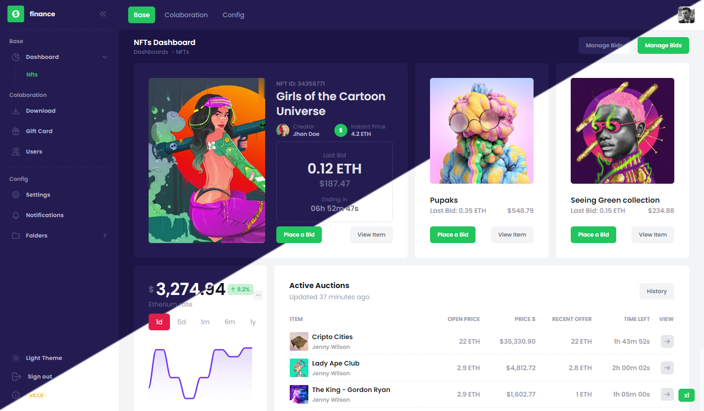

    

#### Features | Tính năng

<b>1. Phòng Tập Luyện:</b> 

Giáo viên tập gym hoặc giảng viên có thể tạo ra các phòng tập luyện khác nhau, mỗi phòng dành riêng cho một loại tập luyện cụ thể hoặc loại hình đào tạo, chẳng hạn như Phòng Aerobic hoặc Phòng Sức Mạnh. Những phòng này hoạt động như các không gian ảo nơi người dùng có thể tham gia để truy cập các bài tập liên quan đến chủ đề cụ thể của phòng đó.

<b>2. Chức Năng Trò Chuyện:</b> 

Trong mỗi phòng tập luyện, người dùng có thể tham gia vào các cuộc trò chuyện với nhau. Điều này có thể được sử dụng để giao tiếp, chia sẻ mẹo, đặt câu hỏi, hoặc tạo nên một tinh thần cộng đồng giữa những người dùng có cùng mục tiêu tập luyện.

<b>3. Theo dõi Tiến triển:</b> 

Cho phép người dùng theo dõi tiến triển tập luyện của họ theo thời gian, bao gồm các chỉ số như trọng lượng tạ, quãng đường đi, hoặc thời gian tập luyện.

<b>4. Gợi ý Tập luyện Cá nhân:</b> 

Triển khai hệ thống gợi ý để đề xuất kế hoạch tập luyện cá nhân dựa trên cấp độ thể dục, mục tiêu và sở thích của người dùng.

<b>5. Tích hợp với Các Thiết bị Đo thể Dục:</b>

Kích hoạt tích hợp với các thiết bị đo thể dục hoặc đồng hồ thông minh phổ biến để tự động ghi lại dữ liệu tập luyện, như nhịp tim, bước đi và lượng calo tiêu thụ.

<b>6. Video Hướng dẫn:</b> 

Cung cấp video hướng dẫn cho các bài tập trong kế hoạch tập luyện. Điều này có thể hữu ích đặc biệt đối với những người muốn có hướng dẫn hình ảnh về cách thực hiện đúng tư thế và kỹ thuật.

<b>7. Chia sẻ Xã hội:</b> 

Cho phép người dùng chia sẻ những thành tựu tập luyện, những thách thức hoàn thành hoặc tiến triển trên các nền tảng truyền thông xã hội để tạo động lực và tăng sự tham gia cộng đồng.

<b>8. Thách thức và Thành tựu:</b> 

Đưa vào thách thức tập luyện và huy chương thành tựu để động viên người dùng và làm cho trải nghiệm tập luyện trở nên thú vị hơn.

See [Demo](https://at.lanno.dev) page.

  

#### Versions

 

#### Commands

| command                   | What it does?                                 |
| ------------------------- | :-------------------------------------------- |
| `npm start`               | Starts the server in dev mode                 |
| `npm run lint`            | Runs ESLint on project                        |
| `npm run prettier`        | Runs prettier on entire src folder            |
| `npm run prettier:verify` | Runs prettier-check and throws error if fails |
| `npm run prettier:staged` | Runs prettier on only staged (changed) files  |

#### Dependencies

| Package            | What it does?                                                                               | Link                                                   |
| ------------------ | :------------------------------------------------------------------------------------------ | :----------------------------------------------------- |
| `angular-svg-icon` | Provides a means to inline SVG files to allow for them to be easily styled by CSS and code. | [Here](https://www.npmjs.com/package/angular-svg-icon) |
| `apexcharts`       | Modern & Interactive Open-source Charts                                                     | [Here](https://www.npmjs.com/package/apexcharts)       |
| `ng-apexcharts`    | Angular wrapper for ApexCharts to build interactive visualizations in Angular.              | [Here](https://www.npmjs.com/package/ng-apexcharts)    |

#### Dev Dependencies

| Package                       | What it does?                                                                                            | Link                                                              |
| ----------------------------- | :------------------------------------------------------------------------------------------------------- | :---------------------------------------------------------------- |
| `prettier`                    | An opinionated code formatter                                                                            | [Here](https://www.npmjs.com/package/prettier)                    |
| `prettier-plugin-tailwindcss` | A Prettier plugin for Tailwind CSS that automatically sorts classes based on our recommended class order | [Here](https://www.npmjs.com/package/prettier-plugin-tailwindcss) |
| `tailwind-scrollbar`          | Tailwind plugin for styling scrollbars.                                                                  | [Here](https://www.npmjs.com/package/tailwind-scrollbar)          |
| `tailwindcss`                 | A utility-first CSS framework for rapidly building custom user interfaces.                               | [Here](https://www.npmjs.com/package/tailwindcss)                 |

#### Icons and Patterns

This project use [Hero Icons](https://heroicons.com/) and [Hero Patterns](https://heropatterns.com/)
